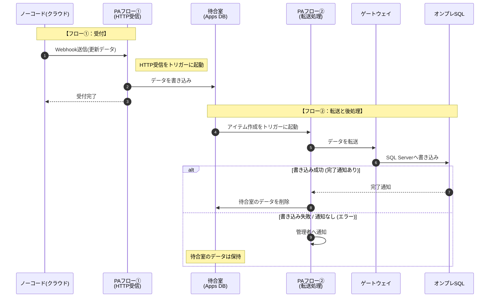

##  プロジェクト概要
社内システムのDX化を目的とした、クラウド（ノーコード）とオンプレミスDBを同期させる連携基盤の設計です。

##  アーキテクチャ図
独自に考案した、バッファ層（待合室）を介した堅牢なデータ転送フローです。

```mermaid
sequenceDiagram
    autonumber
    participant J as ノーコード(クラウド)
    participant PA1 as PAフロー①<br/>(HTTP受信)
    participant W as 待合室<br/>(Apps DB)
    participant PA2 as PAフロー②<br/>(転送処理)
    participant GW as ゲートウェイ
    participant SQL as オンプレSQL

    Note over J, PA1: 【フロー①：受付】
    J->>PA1: Webhook送信(更新データ)
    Note right of PA1: HTTP受信をトリガーに起動
    PA1->>W: データを書き込み
    PA1-->>J: 受付完了

    Note over W, SQL: 【フロー②：転送と後処理】
    W->>PA2: アイテム作成をトリガーに起動
    PA2->>GW: データを転送
    GW->>SQL: SQL Serverへ書き込み
    
    alt 書き込み成功 (完了通知あり)
        SQL-->>PA2: 完了通知
        PA2->>W: 待合室のデータを削除
    else 書き込み失敗 / 通知なし (エラー)
        PA2->>PA2: 管理者へ通知
        Note over W: 待合室のデータは保持
    end
```
